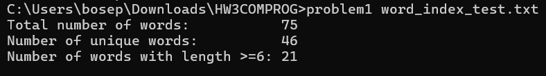
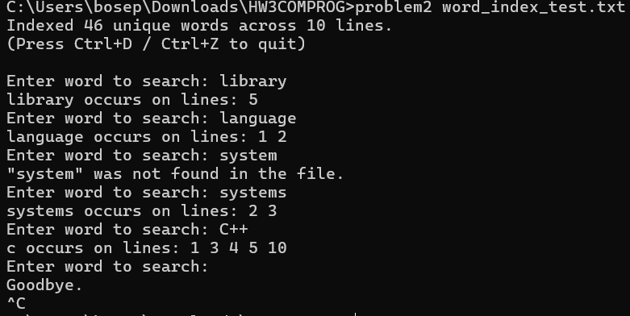
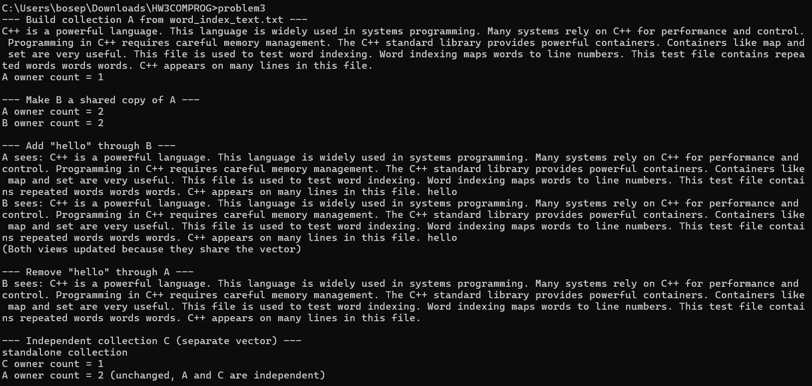
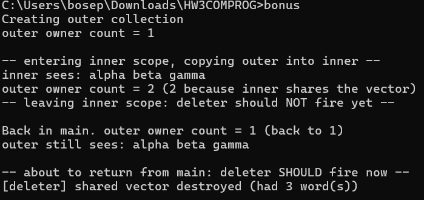

# cpp-homework-3

**Name:** Joseph
**Course:** EE 5102 / EE 4953 — Engineering Programming
**Assignment:** Homework 3 — STL Algorithms, Associative Containers, and Dynamic Memory

This directory contains my solutions for HW3. Each problem lives in its own
`.cpp` file and can be compiled independently. All programs were tested with
`g++ -std=c++11 -Wall -Wextra` and compile with no warnings.

## Files

| File | Description |
|---|---|
| `problem1.cpp` | Text statistics using STL generic algorithms |
| `problem2.cpp` | Word-to-line-number index using `map<string, set<int>>` |
| `problem3.cpp` | `TextCollection` class with `shared_ptr` ownership |
| `bonus.cpp` | `TextCollection` with a custom deleter that logs destruction |
| `word_index_test.txt` | Text file used as input for all demos below |

## Build instructions

From inside this directory:

```bash
g++ -std=c++11 -Wall -Wextra -o problem1 problem1.cpp
g++ -std=c++11 -Wall -Wextra -o problem2 problem2.cpp
g++ -std=c++11 -Wall -Wextra -o problem3 problem3.cpp
g++ -std=c++11 -Wall -Wextra -o bonus    bonus.cpp
```

## Run instructions

```bash
./problem1 word_index_test.txt
./problem2 word_index_test.txt    # then type words to query, Ctrl+Z then Enter to quit
./problem3                        # reads word_index_test.txt automatically
./bonus                           # shows the custom deleter firing
```

---

## Problem 1 — Text Processing with Generic Algorithms

Reads a text file from the command line, loads every whitespace-separated
token into a `vector<string>`, and normalizes each word (lowercase + remove
punctuation). Then uses only STL algorithms — no range-based for loops and no
`operator[]` — to sort, remove duplicates, and count long words.

Key algorithms used:
- `std::transform` — to normalize the vector and to lowercase each word
- `std::remove_if` + `erase` — to strip punctuation and drop empties
- `std::sort` — to sort alphabetically
- `std::unique` + `erase` — to remove duplicates
- `std::count_if` — to count words with `length >= 6`

**Sample output (using `word_index_test.txt`):**
```
Total number of words:           75
Number of unique words:          46
Number of words with length >=6: 21
```



---

## Problem 2 — Associative Containers: Word Index

Reads the file line by line, keeps a running line counter, and for each
normalized word inserts the current line number into
`map<string, set<int>>`. `set<int>` automatically keeps the line numbers
sorted and de-duplicated, and `map` gives O(log n) keyed lookup by word.

After indexing, the user can repeatedly type a word. The program prints the
sorted list of line numbers, or an appropriate message if the word isn't in
the file. Querying ends when `cin` hits EOF (Ctrl+Z then Enter on Windows,
Ctrl+D on Linux/Mac).

**Sample interaction:**
```
Enter word to search: language
language occurs on lines: 1 2
Enter word to search: systems
systems occurs on lines: 2 3
Enter word to search: words
words occurs on lines: 8 9
Enter word to search: C++
c occurs on lines: 1 3 4 5 10
Enter word to search: xyzzy
"xyzzy" was not found in the file.
```

Note that `"words"` appears three times on line 9 of the file
(`"...repeated words words words."`) but only shows up once in the output
— `set<int>` automatically dedupes line numbers. Also note that `"C++"` is
normalized to `"c"` because the `+` characters are stripped as punctuation,
which matches the assignment's rule that *"words are considered distinct if
they differ by capitalization or punctuation."*



---

## Problem 3 — Dynamic Memory and Object Lifetime

`TextCollection` wraps a `vector<string>` inside a
`std::shared_ptr<std::vector<std::string>>`. The class provides:

- default constructor (creates an empty shared vector)
- file constructor (reads whitespace-separated words)
- `addWord` / `removeWord`
- `printAll` (insertion order)
- `ownerCount` (for debugging, returns `use_count()`)

**Ownership semantics:** copying a `TextCollection` copies the `shared_ptr`,
which increments the reference count. Both objects now point at the *same*
vector, so `addWord` or `removeWord` through one view is instantly visible
through the other. When the last owner goes out of scope, the vector is
destroyed automatically — no manual `delete`, no leaks.

The `main()` function demonstrates:
1. Building collection `A` from `word_index_test.txt`
2. Copying `A` into `B` (both share the vector — owner count goes to 2)
3. Adding a word through `B` and showing `A` sees it too
4. Removing a word through `A` and showing `B` sees the removal
5. An independent collection `C` that does NOT affect `A`



---

## Bonus — Custom Deleter and Resource Logging

Same `TextCollection` as Problem 3, but the `shared_ptr` is constructed with
a custom deleter lambda that prints a message when the vector is actually
freed. `main()` creates an outer collection, enters an inner scope that makes
a shared copy, leaves the inner scope, and finally returns from `main`. The
deleter only fires on the final return — proving that shared ownership keeps
the vector alive until the very last owner goes away.

**Sample output:**
```
Creating outer collection
outer owner count = 1

-- entering inner scope, copying outer into inner --
inner sees: alpha beta gamma
outer owner count = 2 (2 because inner shares the vector)
-- leaving inner scope: deleter should NOT fire yet --

Back in main. outer owner count = 1 (back to 1)
outer still sees: alpha beta gamma

-- about to return from main: deleter SHOULD fire now --
[deleter] shared vector destroyed (had 3 word(s))
```

Notice that no `[deleter]` message prints when the inner scope ends — only
when `main` returns. This is exactly the last-owner-wins behavior the problem
asks for.


